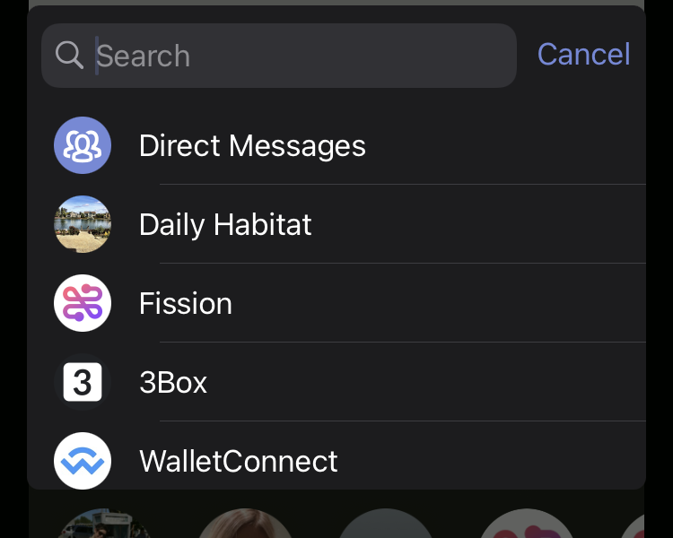

## End of day notes and article links

Thanks @elty and @expede for deep meaningful conversations today. Pointers to some of the links and articles we talked about:

* I'm still working on my [[Garden and the Gazebo]] post here talking about public / private notes. My [[Second Brain]] explanation is also WIP
* I was importing old posts and looked at [[Tomi Ahonen: app stores are tiny compared to global telecom revenue]]. My takeaway from that was _The future is Internet + identity + payment, and app stores will figure heavily in that future_ -- and now this is the direction that [[Fission]] is pointed: a web native app store that connects people with the apps they use and the developers that make them
* I'm going to start collecting [[Movement Marketing]] concepts, like [David Sacks' Your Startup is a Movement](https://sacks.substack.com/p/your-startup-is-a-movement) article
* I mentioned [[Cobuying Property with Friends]] for a second time, so I made a dedicated page for it. It's an example of an article that made my knowledge about something go from 0 to 80%, and I feel equipped to do further exploring from there
* [Exit to Community](https://www.noemamag.com/exit-to-community) is relevant relating to the MEC Co-op sale to private equity in Canada, to governance tokens in crypto around SushiSwap https://sushiswap.org (this [Decrypt article has some background context](https://decrypt.co/41236/sushiswap-what-happened-what-it-means-for-defi-and-whats-next)) and yearn.finance (I don't even know how to summarize that)
* [[Athens]] seems like the best candidate to deeply integrate Fission's [[WNFS]] with, and we could also be a source of revenue for hosting them. They have [an open issue to pick a backend architecture](https://github.com/athensresearch/athens/issues/9). I'm still interested in integrating Fission with [[Roam Research]] (maybe apply for their grant / investment program?) -- and I think the WNFS / IPFS file graph, unique, permanent links will be interesting to many of these [[Second Brain]] tools.

Yes, sending people links / notes motivates me to curate and add to the things I have here.

## Coffee with Bob in Dunbar

Met up with @BobSummerwill who took a picture of me next to my [[Radrunner]]:

<blockquote class="twitter-tweet" data-lang="en" author="@BobSummerwill">

Lovely to see @bmann for the first time in months.  On his mighty steed!
&mdash; Bob Summerwill (@BobSummerwill) <a href="https://twitter.com/BobSummerwill/status/1308561566393008129">September 22, 2020</a>
</blockquote>

## Primeflow and Market Networks

I had a call with Daniel from [[Primeflow]] yesterday. He [left a comment on LinkedIn](https://www.linkedin.com/feed/update/urn:li:activity:6713859370926657536?commentUrn=urn%3Ali%3Acomment%3A%28activity%3A6713859370926657536%2C6714274081841262593%29) pointing out that we covered a lot of the ground discussed in NFX's [The Next 10 Years Will Be About “Market Networks”](https://www.nfx.com/post/10-years-about-market-networks/). My [[Processing]] page is getting too long.

### Fission Web Native iOS App

I saw a tweet that [Apple is recruiting for an interesting role](https://twitter.com/jnadeau/status/1305697216347037696) -- "you'd contribute to Cloud File Providers and work with adopters to get their cloud storage systems integrated across the OSes". I've noticed for a while that Apple has been very careful to make storage an API -- it works with iCloud and your local file system by default, but you can set it to Dropbox or Google Drive or others if you have those apps installed. This operating system stickiness through superior integrations at a very low system level.

For us at [[Fission]], I discussed a couple of ideas with Brooke today. One, a native mobile app for Fission is key -- it means that any other app on iOS that can share files we can use Fission both as a storage system, and as a target to share / copy files into.

The second idea I came up with was how, by having a native app, we can in fact pass on that ability to ALL the other apps built on the Fission webnative framework to automatically have native integration. Sign in with your Fission account, which knows all the apps that it has connected to, and then you can "Share to Fission", and select which app you want to share to.

Here's a screenshot of how you can pick between different [[Discord]] servers as an example of how existing native apps handle multi-target share sheets:

This is a whole other layer of network effects in giving a ton of apps native mobile integration. Need to talk to the [[Expo]] folks about this.

### Small Business Peer Roundtable

I ran some small business / entrepreneur peer sessions in Comox that continued on as [[WeAreYQQ]]. I did something similar over lunch with folks at [[Input Cowork]] when we [went for a visit last summer](https://blog.fission.codes/coworking-in-nanaimo-input-cowork-nanaimo-tech-meetup/).

I've decided, especially as we get into the winter months, and as we continue to think about this pandemic as a way to think differently and make change happen, to do at least one mini roundtable with some small businesses and interesting people. Talked to one of the businesses today and they said yes. Thinking about whether to connect this with [[Venture Scouts]] -- feels like it would be a fit, but I'm also OK with it just being a one off.

I guess I'll make a placeholder for this: [[SMB Peers]]

### Done with LogSeq?

I think I'm done with [[LogSeq]]. It isn't currently syncing with Github reliably. It _has_ indexed the contents of this public notes Garden as well as just basic files, and that is very interesting to me, but it doesn't work at all on mobile, and has real trouble with the amount of files that I have in this repo. Inspecting it in the browser it looks like it's storing 1.1GB.

_Maybe_ if I split public Garden / private Gazebo into separate repos that would help.

But I think more time with [[Roam Research]] for private notes makes sense. This was working for me before, but I just went on this epic journey of looking for something that was open source / could be self hosted.

It will be interesting to see if I can import the markdown files into other systems. [[LogSeq]] uses multiple levels of hashes -- which in default markdown are headings -- which makes it look weird in every other system. Also, Roam can only handle 10 pages at a time.