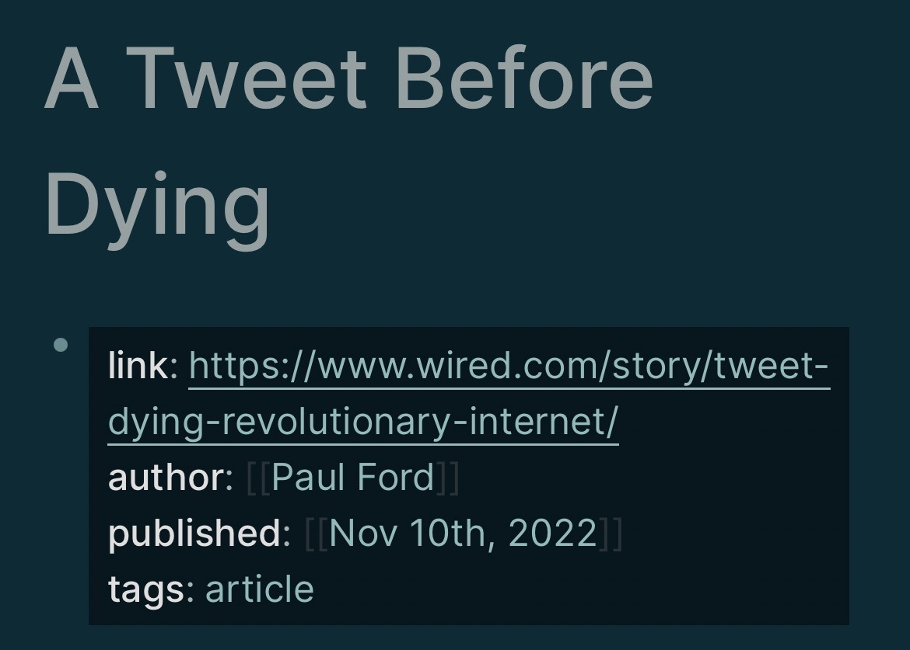

---
---

tags:: #LogSeq, #howto, #properties

- I could never quite figure out how some pages seemed properly tagged and others weren’t
- The way LogSeq Properties work, is that the first lines of a file
	- Don’t have a bullet
	- Are new line / return delimited
- I knew this, but just thought putting arbitrary properties “at the top” — in the first few bullets — was enough
- On mobile, the properties of a page have a dark background
- If you go into that dark background line, you can hit return and add more properties, without creating a bullet
- Correct
	- link, author, published, and tags properties, in any order, at the top of a file
	- Dark background
	- 
- Incorrect
	- Only the link property is an actual property
	- Need to fix so that tags is also within that dark area, not a “second bullet”
	- This still “works” in this case for backlinks, but won’t show in the special “Pages tagged with ‘article’” section that is built into LogSeq by default
	- 
	-