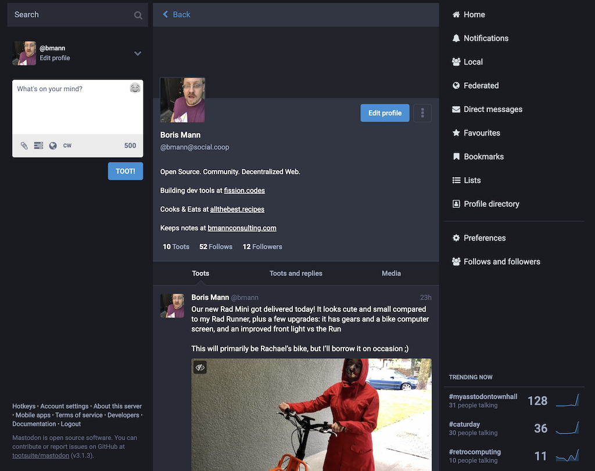

---
---

type:: blog
published:: [[October 8th, 2020]]
tags:: #co-op, #Mastodon, #Social.Coop

- 
  
  I've just finished getting onboarded into [[Social.Coop]], a cooperative that maintains social media technology together, supported by member funding.
  
  In particular, the main thing the co-op runs is a [[Mastodon]] instance. You can think of Mastodon as an open source Twitter, except spread across multiple individual servers. I've been meaning to setup an active Mastodon account again.[^mastoheroku]
  
  Ultimately I want to see these sorts of social software systems scale down to the individual, but they way they are architected has to fit that model. Mastodon is too complex, and thus costly, for an individual to run, and I want to more directly explore collective governance and funding models, so Social Co-op seems like a great fit.
  
  Here's what the [Social.Coop wiki has to say](https://wiki.social.coop/home.html):
  
  > **What?:** Social.coop is is an experiment in user-controlled social media. It is a community hub for people interested in co-ops and development of free/libre social media - these define the common core field of discussion, though they are far from the only things discussed.
  >
  >We primarily run a [[Mastodon]] social media server: one node in the [[Fediverse]], a federated network of social media applications which communicate using the [[Activity Pub]] and [[OStatus]] protocols.
  >
  > **Why?:** What distinguishes us from most other social media there is that ==we are both funded and governed by our members: we are a co-operative==. The organisation and running of the site is accountable to its members, and not only will we not be monetising our users by selling their data to third parties, but they decide what we do.
  
  They use [Open Collective to collect monthly or annual funds](https://opencollective.com/socialcoop), where the member can choose what amount to fund. The goal is to be as accessible as possible, so the minimum member tier is just £1 / month.
  
  [[Loomio]] is what is used for discussion, governance, and operations, with Community, Tech, and Finance Working Groups. You need to be a member to post, but the [discussions are public in the main Loomio group](https://www.loomio.org/socialcoop/).
- ## How to sign up
  
  To sign up for Social.Coop, start by [filling out the application form](https://wiki.social.coop/registration-form.html). The main thing it asks for:
  
  > In up to 500 characters (the maximum length of a toot on Mastodon), can you tell us a bit about yourself? For instance, why you wish to join social.coop, and what hopes or aspirations you have for the site and/or your participation? We’d like to build a picture of how our members want to use the site.
  
  Here's what I submitted:
  
  > I’m interested in supporting and learning more about co-op structures, especially as they relate to software infrastructure and open source.
  > 
  > I don’t have a current Mastodon account, and if I’m not going to run my own server, I’d like to support a group like this.
- ## What to use Mastodon for?
  
  My account is [bmann@social.coop](https://social.coop/@bmann). The way Mastodon works, Social.Coop is my "home server", but I can follow people on any Mastodon server, and anyone can follow me.[^federated] Please do follow me / introduce yourself so I can follow you! It's been great to start from scratch in exploring the people on the [[Fediverse]] as it is called.
  
  
  
  This is a screenshot of the logged in web interface. There are mobile apps, I'm currently using the open source [[Amaroq]] for iOS. As you can see, it pretty much looks like Twitter and many other modern feed based social media sites.
  
  So what am I going to use this account for? It's definitely an overlap with [[Micro.blog]] in the sense of sharing short notes and images. I've got things setup so I can cross post from Micro.blog to my Mastodon account, and I already do that to post to Twitter.
  
  I think I'll do more cooking content there, but I'm not really going to focus on a bunch of output there.
  
  There are conversations happening in the Fediverse that aren't happening on centralized social media, so I'm definitely interested in that. And, in this emerging area of software co-ops.
- ## Collectives Everywhere
  
  From Social.Coop, I learned about [[Meet.Coop]], which is a coop for running video conferencing software that is an alternative to Zoom. I may end up with a personal account through Social.Coop, and I'm considering buying a company account for [[Fission]].
  
  It's great to see that there is a rise in collective infrastructure like this. Ideally, it should result in more commons infrastructure at various levels. We need to fund the open source code behind apps, **and** we need to fund the operations and hosting of these apps.
  
  What I continue to work on is apps that are intentionally designed to be as simple as possible to host, so that it is much easier for individuals to run it, rather than having to form collectives. That way, we can focus on building out more features and functions at the code, design, and UX layers.
  
  This changes the economic model of building and running software.
- ---
	- [^mastoheroku]: I ran a Mastodon server for myself for a while [[Notes on running your own Mastodon instance on Heroku]]
	- [^federated]: aka a ‘Federated’ model, where there are central servers and some features within just that server, but protocols that allow servers to talk to each other, which supports people being able to communicate between servers. Versus peer-to-peer (p2p) where people would directly connect to each other without a server in the middle.