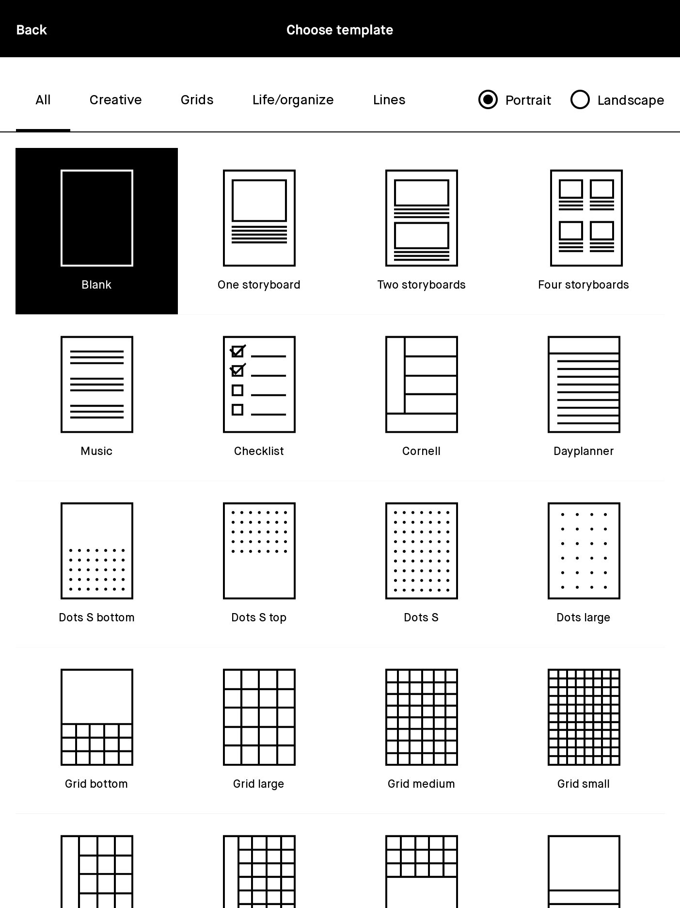

The reMarkable is a "paper tablet" with a monochrome e-ink screen with touch support, and a non-powered stylus.

## Resources

* reMarkable Awesome list - huge list of apps, tools, templates, and more <https://github.com/reHackable/awesome-reMarkable> 
* RemarkableTablet on Reddit <https://www.reddit.com/r/RemarkableTablet/>
* ReMarkable Wiki <https://remarkablewiki.com/>
* rmkit, a site about remarkable app dev https://rmkit.dev/

---

I bought one in [[February 2021]].

<blockquote class="quoteback" data-title="" data-author="Boris Mann" data-avatar="https://micro.blog/boris/avatar.jpg" cite="https://blog.bmannconsulting.com/2021/02/13/sitting-at-the.html">
Sitting at the breakfast table writing what will become a blog post on drop in audio.

Yes, it’s a new <a href="https://remarkable.com/">reMarkable “paper” tablet</a>. I’m using it in the hopes of better deep reading and writing.

Except for a quick microblog to post a picture of it!

<footer>Boris Mann <cite><a href="https://blog.bmannconsulting.com/2021/02/13/sitting-at-the.html">https://blog.bmannconsulting.com/2021/02/13/sitting-at-the.html</a></cite></footer></blockquote>

## Specs

@doriantaylor asked about the dimensions. It's 187 x 246 x 4.7 mm, active screen portion is 10.3”, 1872 x 1404 resolution, 226DPI. Full [technical specifications](https://remarkable.com/#Specifications).

## Templates

Anton @theunfoldingway asked if it supports custom templates. I had just discovered the [regular templates for notes](https://support.remarkable.com/hc/en-us/articles/360002674558-Templates).

Doing a quick search found all these [for sale custom templates](https://www.einkpads.com/), and an app to load them onto your device. But, there are lots of open source tools to help with this.

This video shows how to create and add custom templates on [[Windows]]:

<iframe width="560" height="315" src="https://www.youtube.com/embed/Bl1krpUZTdo" frameborder="0" allow="accelerometer; autoplay; clipboard-write; encrypted-media; gyroscope; picture-in-picture" allowfullscreen></iframe>

## Using

* Official [Chrome Extension](https://chrome.google.com/webstore/detail/read-on-remarkable/bfhkfdnddlhfippjbflipboognpdpoeh)

## To Test

* [Google Drive Remarkable Sync](https://github.com/bsdz/google-drive-remarkable-sync)
* [[ReMailable]]